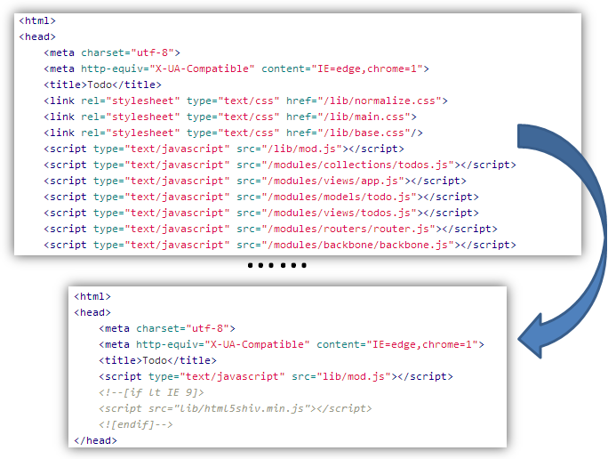

# 前端模块化

FIS通过插件扩展可以完美的支持模块化的前端开发方案，我们通过FIS的[二次封装能力](/docs/dev/solution.html)，封装了一个功能完备的纯前端模块化方案[pure](https://github.com/fex-team/fis-pure)。接下来就让我们使用[pure](https://github.com/fex-team/fis-pure)，体验一下在FIS构建能力的支持下，如何轻松的完成一个**高性能**的纯前端模块化项目的构建与优化工作。

## pure安装

[pure](https://github.com/fex-team/fis-pure)与[fis](https://github.com/fex-team/fis)一样，使用[npm](http://npmjs.org)包管理进行安装。pure的npm包名称为**fis-pure**

```bash
$ npm install -g fis-pure
$ pure -v
```

## 示例准备

与快速入门中的示例项目一样，我们可以使用[Lights包管理](http://lightjs.duapp.com/)安装，也可以从[Github](https://github.com/hefangshi/fis-pure-demo)获取。

```bash
$ npm install -g lights #如果没有安装lights，请先安装
$ lights install fis-pure-demo
```

在构建这个DEMO项目之前，我们可以先粗略的浏览一下项目情况

首先[fis-pure-demo](https://github.com/hefangshi/fis-pure-demo)与[fis-quickstart-demo](https://github.com/hefangshi/fis-quickstart-demo)都是一个TODO DEMO

但是对比一下可以发现，两个项目最大的区别在于fis-quickstart-demo得index.html中包含了大量的脚本和样式资源引用，而在fis-pure-demo中，我们只看到了对[Mod](https://github.com/fex-team/mod)库的引用。



其次通过浏览两者的脚本文件，我们会发现fis-quickstart-demo的脚本中都添加了 ```define``` 包装

```javascript
define('main', function(require, exports, module){
    //content
}
```

而在fis-pure-demo中，则完全看不到 ```define``` 的痕迹，只有与Node.js模块化语法完全一致的 ```require``` 与 ```module.exports```。

## 发布预览

首先我们不附加任何优化参数，进行发布预览

```bash
$ pure release
$ pure server start #如果提示端口冲突可以添加-p参数调整端口
```

打开页面，我们会发现fis-pure-demo与fis-quickstart-demo一样，在页面内准确的引用了需要的脚本与样式资源。而这不同之处在于，这些资源的引用不再需要人工维护，只要使用[pure](https://github.com/fex-team/fis-pure)进行构建工作，不需要任何配置就可以自动完成资源的加载。

当然，我们会发现所有的资源引用都是独立的，发起了大量的HTTP请求，并且随着网站复杂度的提升，这个问题也会越来越严重。可能有的同学已经想到，我们可以使用FIS的资源合并能力对当前项目进行性能优化。

## 性能优化

综合一下我们在快速入门中学到的优化命令，我们为fis-pure-demo进行资源压缩、添加md5戳、资源合并等性能优化工作

```bash
$ pure release -pmo
```

经过简单的一个命令，我们再次刷新页面，可以看到请求数已经大幅减少，可以尝试不同的release优化参数，感受不同的优化参数带来的不同体验。

简单的几个步骤，我们就实现了模块化资源的**自动加载**以及完全**脱离后端**的资源管理能力，是不是感觉很不错呢？不妨自己写一个小DEMO体验一下静态资源自动化管理、性能优化简单可依赖的快感吧！

## 了解更多

实际上pure只是通过FIS的解决方案封装能力封装而成，其底层核心仍然是FIS，与FIS不同之处在于默认集成了一些功能扩展插件，比如用于模块化资源自动加载的[fis-postpackager-autoload](https://github.com/hefangshi/fis-postpackager-autoload)以及静态资源自动合并插件[fis-postpackager-simple](https://github.com/hefangshi/fis-postpackager-simple)。这些插件与配置的集成实际上都是十分简单快速的，具体可以参考[解决方案封装](/docs/dev/solution.html)部分以及[fis-pure](https://github.com/fex-team/fis-pure)的源码部分。如果对pure是如何实现的感兴趣，可以点击[了解更多](/docs/more/fis-mod.html)。


FIS的优势在于灵活的定制、扩展、封装能力，并且通过内建的[语言能力扩展](/docs/more/fis-standard.html)能力，解决了大量复杂繁重的工作，让开发插件变成一种乐趣。无论是个人使用，还是大中小各种规模的团队，都可以通过FIS满足自己的开发需求。

pure与Require.js、Sea.js等模块化方案相比，拥有同步加载脚本资源的能力，首屏渲染时间更短。并且资源打包无需依赖后端Combo服务等外部依赖。但是作为纯前端解决方案，必然也有其局限性，pure不支持类似母版页的技术，每个页面文件均需要是完整的网页，即需要包含完整的head、body元素。如果希望支持后端模板组件化能力，可以[点击这里](/docs/dev/more.html#solution)了解更多的基于FIS的模块化解决方案。
