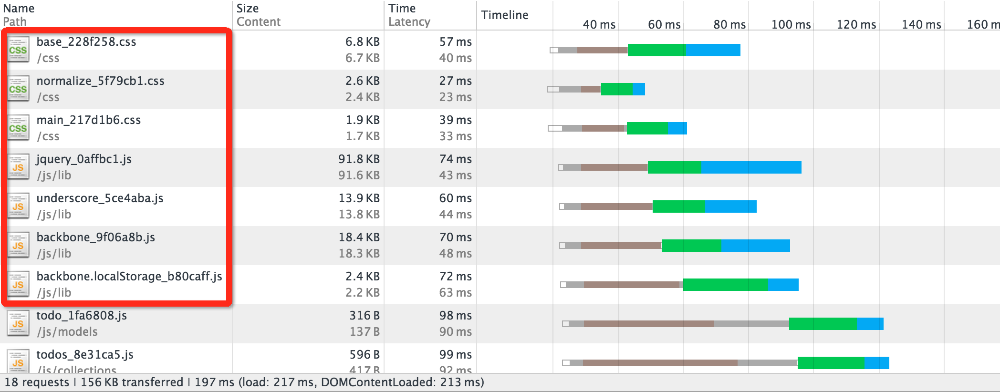
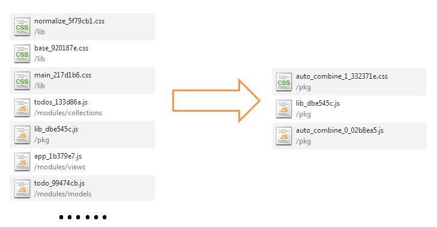
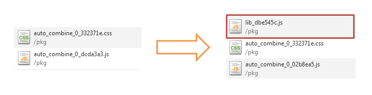

# 快速入门

<!-- > FIS是一个专为解决前端开发中有关自动化工具、性能优化、模块化框架、开发规范、代码部署、开发流程等问题的工具框架。

> FIS与目前流行的构建工具的不同之处在于FIS更加专注于前端构建，对前端项目天生就有理解能力。通过内建功能就可以满足绝大部分前端构建需求，甚至无需进行任何配置就可以实现很多实用的功能。

> 同时FIS不仅仅是配置简单，使用方便。FIS还有完善的插件系统和扩展能力满足你各式各样的需求，更赞的是FIS还支持二次包装，你可以通过对FIS进行简单的封装来打造属于你自己的开发工具。
 -->
<!-- 使用FIS我们可以轻松的完成前端项目的性能优化工作，对应雅虎性能优化14条准则，通过资源压缩减少网站加载的文件体积，通过添加md5戳完美的解决缓存更新问题，通过资源合并尽可能减少HTTP的请求数。 -->

<!-- 让我们快速上手，一起试试看如何使用FIS轻松的完成一个传统前端项目的[资源压缩](/docs/beginning/getting-started.html#资源压缩)、[添加md5戳](/docs/beginning/getting-started.html#添加md5戳)、[资源合并](/docs/beginning/getting-started.html#资源合并)等性能优化工作。 -->

> FIS是专为解决前端开发中自动化工具、性能优化、模块化框架、开发规范、代码部署、开发流程等问题的工具框架。

使用FIS我们可以快速的完成各种前端项目的资源压缩、合并等等各种性能优化工作，同时FIS还提供了大量的开发辅助功能，我们可以通过快速入门进一步的了解FIS。

## 准备工作

### 工具安装

[FIS](https://github.com/fex-team/fis)使用[Node.js](http://nodejs.org/)开发，以[npm](http://npmjs.org/)包的形式发布。因此使用FIS需要先[安装Node.js](http://www.baidu.com/?isidx=1#wd=Node.js+%E5%AE%89%E8%A3%85)，再通过npm安装命令进行FIS安装。

```bash
$ npm install -g fis
```

安装遇到困难？[点击这里](https://github.com/fex-team/fis/issues/65)

### 示例准备

在介绍FIS的主要功能前，需要先准备一个示例项目。我们可以使用[Lights包管理](http://lightjs.duapp.com/)安装，也可以从[Github](https://github.com/hefangshi/fis-quickstart-demo)获取。

```bash
$ npm install -g lights #要求node版本在v0.10.27以上
$ lights install fis-quickstart-demo
```

### 本地预览

首先我们可以通过 ```fis server start``` 命令启动FIS的本地调试服务器功能对构建发布的项目进行预览调试

```bash
$ cd fis-quickstart-demo
$ fis release #不进行任何优化发布一次
$ fis server start #如果8080端口被占用，使用-p参数设置可用的端口
```

> 可以通过 ```fis server start --type node``` 启动Node版fis server，无需java、php等环境依赖。

本地调试服务器启动成功后，就会自动打开 ```http://127.0.0.1:8080```

<!-- 我们可以利用浏览器的开发者工具查看一下网站的静态资源统计 ```15 requests|399KB transferred``` -->

<i class="anchor" id="optimize"></i>

## 资源压缩

资源压缩一直是前端项目优化中非常重要的一环，使用FIS我们无需任何配置，只需要一个命令就可以完成压缩工作。

```bash
$ fis release --optimize
```

FIS默认的产出目录可以通过 ```fis server open``` 打开，详情可以参考[FAQ](https://github.com/fex-team/fis/issues/70)

查看一下网站的静态资源，我们会发现脚本、样式、图片资源都已经压缩完成。无需额外的插件和配置编写，一条命令就完成了压缩工作，是不是非常方便快捷？

<!-- 再次查看一下网站的静态资源统计 ```15 requests|146KB transferred``` ，可以发现静态资源已经被压缩。并且不仅仅是脚本资源与样式资源被压缩，包括所有图片资源也默认进行了无损压缩。

是不是很简单呢？FIS会默认对脚本与样式表资源以及图片进行压缩，通过安装插件还可以无缝使用[coffescript](https://github.com/fouber/fis-parser-coffee-script)、[less](https://github.com/fouber/fis-parser-less)、[sass](https://github.com/fouber/fis-parser-sass)等前端语言进行开发并对其编译结果进行压缩。
 -->

> FIS默认会调整所有资源引用的相对路径为绝对路径，如果只是单纯的希望对项目的脚本、样式、图片进行压缩，不希望对资源引用地址做调整，可以直接使用基于FIS封装的[spt](https://github.com/fouber/spt)。

<!-- > 细心的朋友可能还会发现，index.html中原本使用相对路径对资源定位，在我们的构建产出中已经全部修改为了**绝对路径**，这是因为FIS构建工具内置了[三种语言能力](/docs/more/fis-standard.html)，其中资源定位功能会将所有路径引用调整为绝对路径。

> 如果只希望对静态资源进行压缩，不希望对路径进行调整，可以通过[配置文件](https://gist.github.com/hefangshi/a7bee8a1b29f3f85f1a0)关闭标准化处理功能。但是标准化处理功能是FIS的核心特色，除非需求仅是对资源进行压缩，否则不建议关闭。
 -->

<i class="anchor" id="md5"></i>

## 添加文件版本

FIS能够根据静态资源的内容自动生成文件版本，自动更新资源引用路径，解决缓存更新问题，告别手动更新时间戳。

我们通过开启 ```--md5``` 参数，为项目中的静态资源添加md5版本号

```bash
$ fis release --optimize --md5
```

刷新页面，我们可以看到所有资源均加上了md5版本号



> 还是喜欢时间戳？没问题，FIS也可以满足你的需求，[点击这里](https://github.com/fex-team/fis/issues/73)

<i class="anchor" id="combine"></i>

## 资源合并

<!-- > 通过FIS，我们可以引入多种静态资源管理模式，比如百度内部使用的FIS-PLUS解决方案，通过Smarty插件扩展的形式收集静态资源，同时可以根据模块的线上调用统计日志智能化的进行资源合并管理。

> 关于FIS的静态资源管理思路，可以参考 [静态资源管理与模板框架](http://www.infoq.com/cn/articles/front-end-engineering-and-performance-optimization-part2/)，但是这里描述的是一种较完备的方案，需要根据后端的技术选型进行一些后端模板开发。本篇指南则是介绍一种利用FIS在构建阶段自动完成资源合并工作的方法，使用成本更加低，更加适合中小型项目。
 -->

FIS内置提供了[pack](/docs/api/fis-conf.html#pack)设置为资源进行打包，同时为了达到静态资源引用标签自动合并的目的，我们需要扩展FIS的功能，添加简单打包插件[fis-postpackager-simple](https://github.com/hefangshi/fis-postpackager-simple)。

<!-- 它的功能是收集页面中的已有的script和link标签，将这些标签引用的资源进行自动合并，并将原有的script和link标签替换为自动合并后的标签，最终达到页面级的静态资源合并能力。-->

### 插件安装

> FIS的编译系统拥有一个使用简单、扩展方便的插件体系，这套插件体系保证了FIS编译工具的灵活性和生命力。这里我们简单介绍一下FIS插件的安装方法，更加详细的插件系统介绍可以查看配置API [modules](/docs/api/fis-conf.html#modules)。

插件的安装分为两步，首先我们需要通过[npm](http://npmjs.org)包管理工具进行插件安装

```
$ npm install -g fis-postpackager-simple
```

插件安装到本地后，我们还需要通过项目配置文件开启插件，修改项目根目录下的fis-conf.js配置，开启fis-postpackager-simple插件

```
$ cd fis-quickstart-demo
$ vi fis-conf.js
```

```javascript
//file : fis-conf.js
fis.config.set('modules.postpackager', 'simple');
```

### 资源合并优化

对于[减少HTTP连接数](http://www.baidu.com/?isidx=1#wd=%E5%87%8F%E5%B0%91HTTP%E8%BF%9E%E6%8E%A5%E6%95%B0)的必要性在这里我们就不再赘述。让我们直接试试看在fis-postpackager-simple插件支持下，如何通过FIS对这些独立的请求进行合并。

```bash
$ fis release --optimize --md5 --pack
```

如果觉得参数输入比较麻烦，实际上也有等价的更短的命令可以灵活组合，更多的参数可以参考[命令行](/docs/api/cli.html)。

```bash
$ fis release -omp
```

再次浏览我们可以发现所有的脚本资源均被自动合并为了一个文件，关于fis-postpackager-simple插件更多的静态资源处理策略和使用方法，请参考[fis-postpackager-simple](https://github.com/hefangshi/fis-postpackager-simple#%E9%9D%99%E6%80%81%E8%B5%84%E6%BA%90%E5%A4%84%E7%90%86%E7%AD%96%E7%95%A5)。



### 人工干预合并

我们可以通过[pack](/docs/api/fis-conf.html#pack)设置来干预合并结果。人工干预的必要性在于我们可以将类似underscore、jquery、backbone等基础库固定打包，首先我们可以让不同页面之间公用这些基础库而不用重新下载，其次由于基础库不容易改变，这种策略也对缓存更加友好。

修改fis-conf.js配置，加入pack配置

```javascript
fis.config.set('pack', {
    'pkg/lib.js': [
        '/lib/mod.js',
        '/modules/underscore/**.js',
        '/modules/backbone/**.js',
        '/modules/jquery/**.js',
        '/modules/vendor/**.js',
        '/modules/common/**.js'
    ]
});
```

再次运行FIS构建项目

```bash
$ fis release -omp
```

我们会发现 ```lib.js``` 已经被独立打包加载了



### 合并图片

通过上述几个步骤，我们已经成功将脚本资源和样式表资源进行了合并，但是为了进一步的减少HTTP连接数，我们还可以对引用的图片资源进行进一步的合并。

用于图片合并的插件[csssprites](https://github.com/fex-team/fis-spriter-csssprites)已经在FIS中内置了，因此无需安装，只需要在fis-conf.js的配置中开启即可

```javascript
//为所有样式资源开启csssprites
fis.config.set('roadmap.path', [{
    reg: '**.css',
    useSprite: true
}]);
//设置csssprites的合并间距
fis.config.set('settings.spriter.csssprites.margin', 20);
```

> 使用csssprites合并的图片需要在图片路径处添加query标识，示例项目中已经预先添加，更详细的使用方法可以参考[使用文档](https://github.com/fex-team/fis-spriter-csssprites#%E4%BD%BF%E7%94%A8)

再次运行FIS构建项目

```bash
$ fis release -omp
```

刷新一下，添加几个待办项，我们会发现所有待办项的图片都合并在了一张图片中。


## 问题反馈

如果在使用过程中遇到了无法解决的问题，可以先查看一下[FAQ](https://github.com/fex-team/fis/issues?labels=faq&page=1&state=open)，我们会定期收集经常被提到的问题。

如果FAQ中也无法找到答案，我们也提供多种渠道解决你的问题。

* 在Github中提交[Issue](https://github.com/fex-team/fis/issues/new)
* 在文档评论中提问
* 在QQ交流群315973236中直接沟通

## 写在最后

至此，我们完整的演示了如何使用FIS对一个传统的Web项目如何进行资源压缩、合并等优化工作，大幅提高网站性能，FIS与业内的其他构建工具不同之处在于FIS能够理解的项目，不再需要手工定制流程，因此整个构建过程需要的[配置工作](https://github.com/hefangshi/fis-quickstart-demo/blob/master/fis-conf.js)非常的少，仅需一个命令，就可以完成一系列的优化工作。

除了构建能力之外，FIS还提供了各种辅助开发功能，比如文件监听、自动编译、自动刷新等功能，具体用法可以参考[辅助开发](/docs/beginning/assist.html)。

<!--但是这样就满足还是太早了，有没有觉得就算有了资源自动合并，但是每次还要手动的添加资源引用是一件非常繁琐的事情，并且可能有一天某个资源已经不需要使用了，还需要去手工维护这段代码的引用是不是非常恼人呢？特别是如果一个脚本的功能可能被多个地方使用的话，不经过回归测试，你还敢轻易的移除它么？

实际上这些问题都可以用前端模块化来解决，通过前端模块化开发，我们可以不再担心各种资源加载问题，就像编写Node.js程序一样编写前端项目。那么除了业界流行的各种前端模块化加载库，FIS也提供了一种新的思路来解决模块化加载问题，点击[前端模块化](/docs/advance/modjs-solution.html)了解更多。
-->

如果对FIS的运行原理和设计思想感兴趣，可以参考[更多文档](/docs/dev/more.html)。FIS完全开源并托管在Github，欢迎大家Star、关注[FIS](https://github.com/fex-team/fis)的项目主页，大家的支持是我们最大的动力；）

<!--
## 功能介绍

* 超低学习成本，只须使用 ``1`` 条命令即可满足大量需求
* 可以高效的对各种静态资源进行压缩，提高页面性能
* 所有静态资源自动加 ``md5版本戳``，服务端可放心开启永久强缓存
* 内置强大的[图片合并](https://github.com/fex-team/fis-spriter-csssprites)功能，简单易用，
* 内置对html、js、css的 [三种语言能力](/docs/more/fis-standard.html) 扩展，解决绝大多数前端构建问题
* 内置本地开发调试服务器，支持完美运行 ``java``、``jsp``、``php`` 等服务端语言
* 支持文件监听，文件一旦修改，将会自动增量编译
* 支持浏览器自动刷新，可同时刷新多个终端中的页面，配合文件监听功能可实现保存即刷新
* 支持部署到远端服务器，配合文件监听，浏览器自动刷新功能，可实现保存即增量编译部署
* 可灵活扩展的插件系统，支持对构建过程和命令功能进行扩展，现已发布N多 [插件](https://npmjs.org/search?q=fis)
* 通过插件配置可以在一个项目中无缝使用 [less](https://github.com/fouber/fis-parser-less)、[coffee](https://github.com/fouber/fis-parser-coffee-script)、[markdown](https://github.com/fouber/fis-parser-marked)、[jade](https://npmjs.org/package/fis-parser-jade)等语言开发
* 可配置 [目录规范](/docs/api/fis-conf.html#roadmap)，使前端项目的开发路径与部署路径解耦
* 支持二次包装，比如 [spmx](https://github.com/fouber/spmx)、 [phiz](https://github.com/fouber/phiz/)、 [chassis](https://github.com/xspider/fis-chassis)，对fis进行包装后可内置新的插件、配置，从而打造属于你们团队的自己的开发工具
* 抹平编码差异，开发中无论是gbk、gb2312、utf8、utf8-bom等编码的文件，输出时都能统一指定为utf8无bom（默认）或者gbk文件
-->
